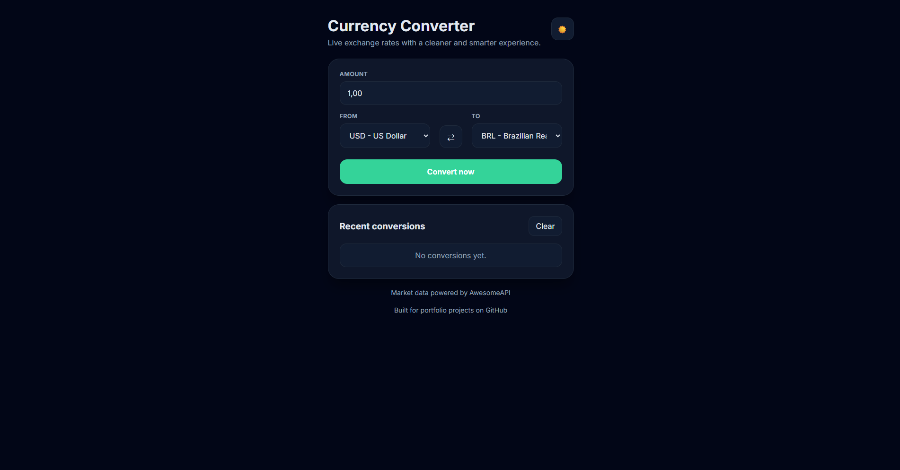

# 💱 Currency Converter

A modern, intuitive and real-time currency converter built with HTML, CSS and JavaScript.

This project was created as part of my development journey, focusing on building something that feels real, useful and well-designed — not just another basic exercise.

---

## 📸 Preview

<p align="center">
  
</p>

🔗 Live Demo: https://kashpl.github.io/currency-converter/

---

## ✨ Features

- 🔄 Real-time currency conversion (AwesomeAPI)
- 🌙 Dark mode with persistent settings
- ⇄ Currency swap with one click
- 🧠 Smart BTC conversion (handles API limitations)
- 📊 Conversion history using localStorage
- ⏱ Auto-refresh every 60 seconds
- ⚡ Fast, responsive and user-friendly interface

---

## 🛠️ Tech Stack

- HTML5
- CSS3 (custom styling, no frameworks)
- JavaScript (Vanilla JS)
- AwesomeAPI (exchange rates)

---

## 📦 How to Run Locally

1. Clone the repository:

```bash
git clone https://github.com/kashpl/currency-converter.git
